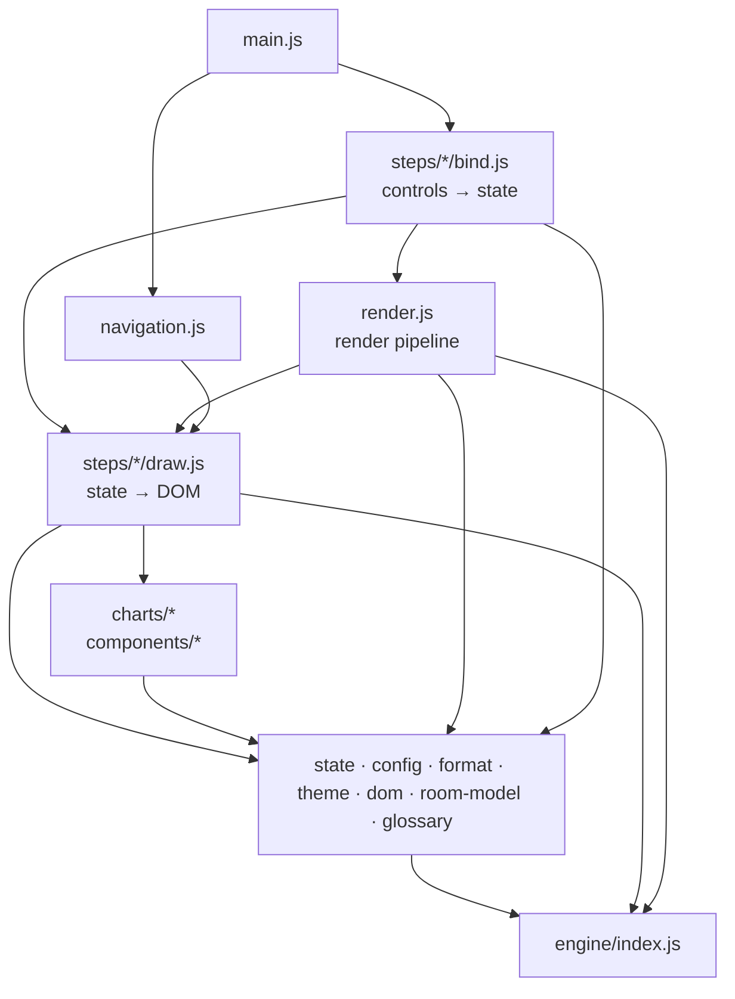

# Architecture

The demo is a plain-JavaScript page with no framework and no runtime dependency. The source is split into small
ES modules with one responsibility each; the build bundles them into one self-contained file,
`dist/index.html`, which also works offline and opened straight from the disk.

Three rules hold the structure together:

1. **The engine knows nothing about the page.** `src/engine/` is pure computation: no DOM, no global state.
   It runs the same way in the browser and in the Node tests.
2. **Data flows one way.** A control changes the `state`, calls one function of the render pipeline, and the
   drawing functions read the `state` and write the DOM. Drawing functions never change the state.
3. **No import cycles, no large files.** ESLint rejects any file over 150 lines of code and any function over 60.

## Folders

```
src/
├── index.html              page shell: head, header, footer, and one include per step
├── sections/               the text and structure of each step: data.html, room.html … monitor.html
├── main.js                 entry point: binds every step, then draws the page once
├── engine/                 the model: pure functions, no DOM
│   ├── index.js            public API: the only file the UI and the tests import
│   ├── config.js           DEFAULTS (data size, seed, tree, search, PSI thresholds), COHORTS (years)
│   ├── random.js           seeded random generator (same seed → same clients)
│   ├── features.js         the signals (FEATURES): the single list the model, tables and rule builder use
│   ├── world.js            WORLD: how synthetic clients behave (the hidden truth)
│   ├── generate.js         synthetic clients: learning, test and production cohorts
│   ├── game.js             the game's 8 clients and the room's example rules
│   ├── tree.js             CART decision tree: train, predict, leaves
│   ├── labels.js           tree conditions as readable text
│   ├── evaluation.js       confusion matrix, ROC curve, AUC, ranking score
│   ├── rules.js            scores hand-written rules (the room's) like a model
│   ├── validation.js       cross-validation and the depth search
│   ├── quality.js          data-quality issues: catalog and how they damage the data
│   └── drift.js            Population Stability Index
├── ui/                     the page
│   ├── config.js           CONFIG: every tunable value of the interface
│   ├── state.js            the single mutable state, and values derived from it
│   ├── render.js           the render pipeline (what to redraw when something changes)
│   ├── navigation.js       step buttons, keyboard, URL hash
│   ├── theme.js            chart colours (read from the CSS tokens) and the risk colour ramp
│   ├── format.js           %, €, numbers, signal values, status icons
│   ├── dom.js              small DOM helpers
│   ├── room-model.js       the room's rules: builder conditions, conversion to engine rules
│   ├── glossary/           definitions, links to the Google ML Glossary, the tooltip
│   ├── charts/             SVG charts: tree, validation curve, ROC curve (+ svg.js primitives)
│   ├── components/         reusable widgets (issue-rows: tick box + parameter)
│   └── steps/              one folder per step of the demo
│       ├── data/           1 · The data           draw, bind, csv
│       ├── room/           2 · Your rules         signals, builder, bind
│       ├── train/          3 · Train              draw, inference, search, search-state, bind
│       ├── rules/          4 · Rules              draw (machine rules), room-score (room vs machine)
│       ├── results/        5 · Results            draw, roc, bind
│       ├── clients/        6 · Our 8 clients      draw, bind
│       └── monitor/        7 · Monitor            draw, bind
└── styles/
    ├── index.css           imports every partial below, in cascade order
    ├── tokens.css          colours, radii, fonts (the single source for THEME too)
    ├── base.css, layout.css
    ├── components/         cards, bars, status, issues, glossary
    ├── steps/              one stylesheet per step
    └── utilities.css, responsive.css   last, so they win
scripts/
├── page.mjs                assembles index.html from its sections (shared by build and dev server)
├── build.mjs               assembles the page, bundles main.js and styles (esbuild), inlines all → dist/index.html
└── serve.mjs               npm run dev: serves src/ for development (ES modules need http://)
tests/
├── core.test.js            engine tests (Node, no browser)
├── page-assembly.test.js   the page is assembled from every section; the published file is self-contained
└── page.test.js            end-to-end: drives dist/index.html in jsdom, checks every speaker-notes figure
```

## Where the page text lives

Static text (titles, explanations, labels) is in `src/sections/<step>.html`, one file per step, next to the
markup it belongs to. `src/index.html` only holds the shell and a line `<!-- @include sections/<step>.html -->`
per step. `scripts/page.mjs` replaces those lines; the build and the dev server both use it, so they serve
the same page.

Text that depends on the data or on a setting (figures, years, warnings) is written by the step's `draw.js`,
from `DEFAULTS`, `COHORTS` and `CONFIG`. Glossary definitions are in `src/ui/glossary/terms.js`.

The page is assembled when it is built, not by a server: the result is still one static file. That is what
lets GitHub Pages host it (it serves static files only, no PHP), the QR code of the training deck open it, and
the downloaded copy work offline.

## Layers and dependencies

Arrows read "imports". Each layer only imports from the layers below it.



Inside each step folder, `bind.js` may import `draw.js`, but never the reverse. Two modules also bind their
own controls and so call the pipeline: `room/builder.js` (the rule builder is redrawn with its controls) and
`train/search.js` (the animation). `render.js` never imports them, nor any `bind.js`: that is what keeps
the graph free of cycles (checked: 0 cycles across the 51 modules).

Inside the engine, the leaves are `config`, `random`, `features`, `world`, `game` and `labels`. Then
`generate` and `tree` build on them; `evaluation` builds on `tree`; `rules` and `validation` on `evaluation`;
`quality` and `drift` only need `config` and `random`. `index.js` re-exports the public API.

## The render pipeline

`src/ui/render.js` is the only place that decides what to redraw. Every control calls exactly one of these
functions, from the most upstream change to the most local:

| A control changes…                           | It calls        | Which redraws                                                        |
| -------------------------------------------- | --------------- | -------------------------------------------------------------------- |
| the data (size, split, sample, data quality) | `regenerate()`  | step 1 table, step 2 signals, then `retrain()`                       |
| the model (depth, minimum group, best level) | `retrain()`     | new tree, step 3 (tree, curve, inference), then `refresh()`          |
| the threshold or the € assumptions           | `refresh()`     | steps 5, 4, 6, 7 (results, rules, clients, monitor), `refreshRoom()` |
| the room's rules                             | `refreshRoom()` | step 4 room vs machine, the room's point on the ROC curve            |
| the production data quality (step 7)         | `drawMonitor()` | step 7 only                                                          |
| the reveal button (step 6)                   | `drawReveal()`  | step 6 answers only                                                  |

`setThreshold(t)` (a ROC dot, "Elbow", "Best €") clamps the threshold to the slider range, calls `refresh()`
and announces the result to screen readers.

The "Find the best level" animation (`steps/train/search.js`) is the only asynchronous code. It gets a
run number from `search-state.js`; `regenerate()` cancels it by increasing that number, so a stale
animation stops at its next step instead of drawing over new data.

## A typical interaction

Moving the threshold slider of step 5:

1. `steps/results/bind.js` writes `state.threshold`, then calls `refresh()`.
2. `render.js` calls `drawResults()`, `refreshRoom()`, `drawMonitor()`, `drawRules()`, `drawClients()`.
3. Each of these reads `state`, asks the engine (`evaluate`, `roc`, `predict`…) and writes its part of the DOM.
4. When the slider is released, `announceThreshold()` updates the live region once.

## How to extend

**Add a data-quality issue.** Add an entry to `TRAINING_ISSUES` or `INFERENCE_ISSUES` in
`src/engine/quality.js` (label, parameter with min / max / step / default / unit, and the function that
damages a client). The tick box, its parameter slider and the redraw come for free from
`components/issue-rows.js`. Add an engine test.

**Add a signal (feature).** Describe how it is generated and how it moves the churn risk in
`engine/world.js` and `engine/generate.js`, then declare it once in `FEATURES` (`engine/features.js`). The
tree, the step 1 table, the CSV, the step 2 signal summary and the rule builder all read that list. A number
also needs its builder defaults in `NUMBER_INPUTS` (`ui/room-model.js`). Add its definition to
`ui/glossary/terms.js` if it is technical.

**Add a step.** Write its text in `src/sections/<name>.html` and include it from `src/index.html` (in
order), add its name to `CONFIG.steps`, a folder
`src/ui/steps/<name>/` with `draw.js` (state → DOM) and, if it has controls, `bind.js` (controls → state),
and `src/styles/steps/<name>.css` imported from `styles/index.css`. Call its `bind` from `main.js`, and its
`draw` from the right function of `render.js` (the one that runs when its inputs change).

**Change a value.** Tunable values live in `DEFAULTS` (`engine/config.js`) and `CONFIG` (`ui/config.js`);
colours live in `styles/tokens.css`. The table "Where to change things" in the README lists them.

## Design principles

The code follows the usual principles, applied with the simplest means that work:

- **DRY (Don't Repeat Yourself).** Each fact exists once. The signals are declared once (`FEATURES`); the
  step 1 table, the CSV, the signal summary and the rule builder are derived from them. Values are formatted
  by one function each (`format.js`), and the page is assembled by one function (`scripts/page.mjs`).
- **KISS (Keep It Simple).** No framework and no runtime dependency: HTML strings, one state object, one
  render pipeline. The only build tool (esbuild) turns the modules into one file.
- **YAGNI (You Aren't Gonna Need It).** Nothing is written for a hypothetical need: no translation layer, no
  plugin system, no option only the tests used.
- **Single responsibility.** One file, one job: a step's `draw.js` draws, its `bind.js` binds controls,
  `render.js` decides what to redraw, the engine computes. ESLint caps files at 150 lines, functions at 60.
- **Open / closed.** A new data-quality issue or signal is added by declaring it (catalog entry, `FEATURES`
  line); the widgets and tables that list them are not modified.
- **Small interfaces.** Modules export small, named functions; the UI and the tests only see the engine's
  public API (`engine/index.js`).
- **Dependency inversion, where it pays.** Charts receive their data and a callback (`drawRocChart(svg, data,
onPick)`) instead of reading the state, and the engine never imports the UI. The steps themselves read the
  single `state` directly, the simpler choice for a page of this size.
- Liskov substitution is about class hierarchies; the code has no classes, so it does not apply.

## Conventions

- Modules are ES modules with named exports. A file's name says what it holds; a folder groups one concern.
- Each exported function whose name does not say it all has a one-line doc comment: what it draws or computes.
- No hard-coded figure in the UI: sizes, years, thresholds and texts that quote them come from `DEFAULTS`,
  `COHORTS` or `CONFIG`, so changing a value never leaves a stale sentence.
- No inline style in the HTML; no colour in JavaScript other than the risk ramp in `theme.js`.
- Status is never shown by colour alone: an icon and a label go with it (`format.js` `icon`).
- The training default data (500 clients, seed 101, 80/20) is what the speaker notes quote. `page.test.js`
  checks every one of those figures: if a change moves one, the test fails and the notes must be updated.
- `npm run check` (Prettier, ESLint, tests, html-validate) must pass; the deployment runs it first.
