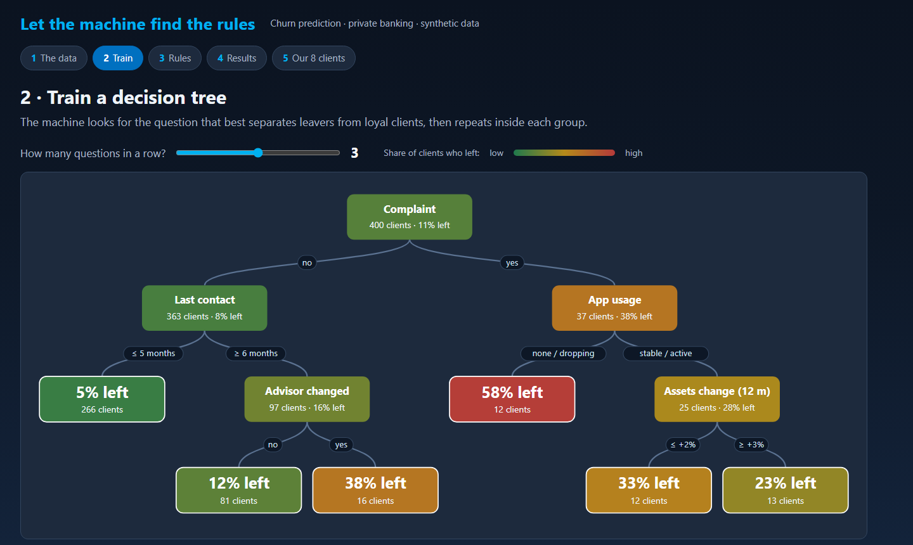

# Banking churn demo: let the machine find the rules

[](https://github.com/FrtZi/banking-churn-demo/actions/workflows/deploy.yml)
[](LICENSE)

**▶ Live demo: [frtzi.github.io/banking-churn-demo](https://frtzi.github.io/banking-churn-demo/)**

An interactive page that shows business people how a prediction model works, without any code.
A decision tree learns live which private-banking clients are likely to leave. The page then shows
the rules it found, the mistakes it makes, and what those mistakes cost.

It was built for the *Data Analytics in Banking – Essentials* training by [Altaïra](https://altaira.eu),
as the follow-up to a paper game in which participants play the model themselves.



## What the audience sees

| Step | Content | Key message |
|---|---|---|
| 1 · The data | 500 synthetic clients: 400 to learn from, 100 kept aside to test | A model learns from the past, and some facts never reach the data |
| 2 · Train | The decision tree, with a slider for how many questions it may ask | More questions give more detail, but also more risk of learning noise |
| 3 · Rules | Each branch written as a plain-English rule, next to the room's own rules | A good model can be read and challenged by the business |
| 4 · Results | Confusion matrix on unseen clients, an alert threshold and a business view in € | Accuracy alone is misleading; the trade-off between errors is a business decision |
| 5 · Our 8 clients | The model's verdict on the 8 clients of the paper game, then the reveal | Model + human judgement beats either alone |

## Using it in a session

- Open the live link, or save the page (it is a single file) and open it offline from a laptop or a USB stick.
- The ← → arrow keys move between steps. `#1` to `#5` at the end of the URL opens a given step.
- Participants can follow on their phones: the layout adapts to small screens.

## Running it locally

Requires [Node.js](https://nodejs.org) 20 or later. There are no dependencies to install.

```bash
npm test        # checks the data generator, the tree and the teaching storyline
npm run build   # writes the single-file page to dist/index.html
```

```
src/core.js         synthetic data generator (seeded) and CART decision tree, no dependencies
src/template.html   page layout, styles and interactions; core.js is inlined at build time
scripts/build.mjs   produces dist/index.html
tests/              unit tests (Node's built-in test runner)
```

Every push to `main` runs the tests and deploys the page to GitHub Pages.

## About the data

The data is **entirely synthetic**. It is generated with a fixed seed, so every run shows the same
numbers. No real bank, client or person is represented. Churn depends on asset trend, time since
the last advisor contact, advisor change, complaints, app usage and products held.

Two facts are deliberately generated but **not** exposed to the model: competitor offers and house
purchases. They produce the errors that no model can avoid, which is one of the points of the demo.

## License

[MIT](LICENSE) © 2026 Altaïra. You are welcome to reuse it for your own training sessions.
